<p align="center">
  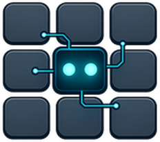
</p>

<h1 align="center">Row-Bot</h1>

<p align="center"><sub>(formerly Thoth)</sub></p>

<p align="center">
   <a href="https://github.com/siddsachar/row-bot/releases"></a>
   <a href="https://github.com/siddsachar/row-bot/actions/workflows/ci.yml"></a>
   <a href="LICENSE"></a>
   
</p>

Row-Bot is a local-first desktop AI assistant for doing real work with models,
memory, and tools. Its name is the operating model: **Reason** through messy
context, **Orchestrate** tools and model providers, and **Work** inside the
files, repos, workflows, and channels you choose.

It combines chat, durable memory, tool use, Agent Profiles, Goal Mode,
child-agent delegation, profile-first workflows, Developer Studio, Designer
Studio, Smart Skills, Skills Hub, Custom Tools, Plugin System v2, messaging
channels, a secure mobile web companion, opt-in native Computer Use, realtime
voice, and provider-aware model routing. Durable app data stays local by
default.

For larger tasks, Row-Bot can keep a visible goal, run the thread through a
focused Agent Profile, and delegate scoped child agents for research, review,
implementation, or follow-up work while preserving tool limits, approvals, and
local run history. Checkpoint-safe work budgets and application-wide delegation
limits keep long or repetitive agent runs bounded and visible.

Choose the model path that fits the task: local models through
[Ollama](https://ollama.com/); provider keys for OpenAI, Anthropic, Google AI,
xAI, MiniMax, OpenRouter,
[Atlas Cloud](https://www.atlascloud.ai/?utm_source=github&utm_medium=link&utm_campaign=row_bot),
[Requesty](https://requesty.ai/),
and Ollama Cloud; subscription or OAuth sign-in for ChatGPT / Codex, Claude
Subscription, and xAI Grok; or custom OpenAI-compatible endpoints such as oMLX,
LM Studio, vLLM, llama.cpp, LocalAI, LiteLLM, and SGLang. Row-Bot keeps
provider identity, capability labels, context limits, media surfaces, and
chat-only fallbacks explicit so local, hosted, subscription, and self-hosted
models can sit side by side.

Row-Bot itself has no account system, no Row-Bot-hosted inference server, and
no first-party telemetry pipeline. Provider calls go to the provider or
endpoint you choose, and provider keys, OAuth tokens, and subscription tokens
are stored in the OS credential store when available. The optional Computer Use
beta depends on Cua Driver, whose separately disclosed upstream telemetry must
be accepted before Row-Bot installs or invokes it.

Download the latest installer from [GitHub Releases](https://github.com/siddsachar/row-bot/releases). Windows and macOS use one-click installers. Linux has a one-line user installer.

<table align="center">
  <tr>
    <td align="center"><a href="https://youtu.be/GA2Tnlt4jNk"></a><br><sub><a href="https://youtu.be/GA2Tnlt4jNk">Turn Research Into a Client-Ready Report with Row-Bot</a></sub></td>
    <td align="center"><a href="https://youtu.be/wOUSGTyfEpk"></a><br><sub><a href="https://youtu.be/wOUSGTyfEpk">Turn Your Inbox Into an Action Plan with Row-Bot</a></sub></td>
  </tr>
  <tr>
    <td align="center"><a href="https://youtu.be/Vuk2xz-vPcA"></a><br><sub><a href="https://youtu.be/Vuk2xz-vPcA">Create a Background AI Workflow with Row-Bot</a></sub></td>
    <td align="center"><a href="https://youtu.be/hRLuOEqbsds"></a><br><sub><a href="https://youtu.be/hRLuOEqbsds">Create Launch Campaign Designs with Row-Bot Designer Studio</a></sub></td>
  </tr>
</table>

## What You Get

| Area | Details |
|------|---------|
| Agent orchestration | LangGraph ReAct agent, Goal Mode, Agent Profiles, Profile Library, child-agent delegation, durable child-agent runs and parent-thread approvals, checkpoint-safe work budgets, repeated-action protection, configurable nesting/concurrency/active-time limits, profile/tool allowlists, agent status and wait tools, promoted Agent-run workflows, generation-scoped cancellation, streaming activity, thinking bubbles, smart context trimming, and per-thread, per-workflow, per-profile, and per-Developer model overrides. |
| Models and providers | Provider-qualified model selection, readiness routing, chat-only fallback for non-tool models, chat/agent/vision/image/video capability labels, custom endpoint profiles and probes, automatic live catalog discovery with last-known-good preservation, xAI Grok OAuth, ChatGPT / Codex and Claude Subscription providers, OpenCode providers, provider-scoped tool-schema compatibility, prompt-cache diagnostics, and background model cache. |
| Memory and knowledge | Personal knowledge graph, 10 entity types, 67 typed relations, bounded semantic/lexical/graph recall, cache-only local embeddings with explicit download/repair and fast lexical/graph fallback, audit and review states, recall traces, graph visualization, Obsidian-compatible wiki export, document extraction with source provenance, Dream Cycle refinement, duplicate merging, stale-confidence decay, relationship inference, self-knowledge, insights, and conversation search. |
| Tools | 30+ core tool modules for web search, DuckDuckGo, Wikipedia, arXiv, YouTube transcripts, URL reading, documents, wiki vault, Gmail, Google Calendar, filesystem, shell, visible browser automation, opt-in native Computer Use, workflows, Goal Mode, child-agent delegation, tracker, channels, X, image generation/editing, video generation, MCP, Developer Studio, Designer Studio, Custom Tool Builder, status, calculator, Wolfram Alpha, weather, vision, memory, system info, and charts. File tools read PDF, CSV, Excel, JSON, JSONL, TSV, and image files, with schema, stats, previews, and PDF export where supported. |
| Developer Studio | Local Git workspace linking and cloning, code threads, per-thread and child-agent worktrees, repo inspector, file tree, diffs, todos, tests, branch, commit, push and PR prep, approval modes, and optional Docker Sandbox with a shadow workspace and explicit import back into the real repo. |
| Designer Studio | Decks, documents, landing pages, app mockups, and storyboards with a sandboxed interactive runtime, templates, brand controls, critique and repair, AI image and video generation, chart insertion, Mermaid and Plotly rendering, shareable HTML, and export to PDF, HTML, PNG, and PPTX. |
| Workflows | Scheduled runs, webhook triggers, task-completion triggers, step pipelines, conditions, approvals, subtasks, notification-only runs, concurrency groups, delivery defaults, profile-first workflow agents, promoted Agent-run workflows, per-workflow model/tool/skill/profile overrides, safety modes, run status, run history, upcoming runs, and a Workflow Console. |
| Controlled self-evolution | Structured self-reflection, bounded change proposals, reviewable execution boundaries, persistence, Dream Cycle and memory integration, and Command Center/status visibility for improvement work that stays explicit and auditable. |
| Channels and voice | Telegram, WhatsApp, Discord, Slack, SMS, and plugin-owned channels with platform-aware live streaming, typing and edit fallbacks, interactive approvals, durable child-agent and Goal Mode notices, media intake, voice transcription, document extraction, health checks, auto-generated send/photo/document tools, and optional tunnel support. SMS remains final-text-only. Realtime voice adds provider-backed voice sessions, action handling, speech/cue policy, and local faster-whisper STT plus Kokoro TTS options. |
| Platform and app | Native desktop app plus a secure browser-first mobile companion for chat, Activity, workflows, Knowledge, and phone-safe settings; opt-in Computer Use setup, live takeover, and permission recovery on Windows and macOS; QR pairing over local network, Tailscale, ngrok, or a custom route; installable PWA support; tray integration on Windows and macOS; native macOS tray host; local browser-first Linux launch; optional Linux native window/tray mode; Home status surfaces; recovery tools; verified auto-updates; and a searchable public user guide. |
| Extensibility | Smart Skills, pinned skills, slash commands, Skills Hub browsing/import/search, Plugin System v2 for native tools, MCP-backed tools, bundled skills, and channels, sandboxed Plugin Center and marketplace, bundled skills and tool guides, Agent Profiles, child-agent tools, Goal Mode tools, external MCP clients over stdio, Streamable HTTP, and SSE, Custom Tools from repos or folders, hardened Custom Tool Builder setup, Claude Code Delegation through an approval-gated CLI worker, migration from selected Hermes/OpenClaw data, setup center, identity settings, and stability diagnostics. |

See [docs/ARCHITECTURE.md](docs/ARCHITECTURE.md) for the full subsystem reference.

## Install

### Windows

1. Download the latest [Windows installer](https://github.com/siddsachar/row-bot/releases/latest).
2. Run it. The installer bundles the embedded Python runtime, app source, and Python dependencies. Ollama is optional and only needed for local models.
3. Launch Row-Bot from the Start Menu or desktop shortcut.

User data lives in `%USERPROFILE%\.row-bot`. Repairing or upgrading replaces the bundled runtime and preserves your data. Startup logs are written to `%USERPROFILE%\.row-bot\row_bot_app.log`, including recovery hints for known optional audio package issues such as TorchCodec.

### macOS

1. Download the latest [macOS DMG](https://github.com/siddsachar/row-bot/releases/latest).
2. Drag `Row-Bot.app` into Applications.
3. Launch Row-Bot from Applications or Launchpad.

The first run may ask you to confirm that the app was downloaded from the internet. The packaged app uses its bundled Python runtime and dependencies, and it starts Ollama if Ollama is already installed. Apple Silicon and Intel Macs are supported on macOS 12+.

If you only want provider models or a custom endpoint, you can skip model downloads during setup.

### Linux

Run:

```bash
curl -fsSL https://raw.githubusercontent.com/siddsachar/row-bot/main/installer/install-linux.sh | bash
```

To install a specific version:

```bash
curl -fsSL https://raw.githubusercontent.com/siddsachar/row-bot/main/installer/install-linux.sh | bash -s -- 4.5.0
```

The installer downloads the release tarball, verifies its SHA256 from the GitHub release manifest, installs under `~/.local/share/row-bot`, creates `~/.local/bin/row-bot`, and stores user data in `~/.row-bot`. The default Linux build opens in your system browser. Native window and tray support are available when the required GTK, Qt, and AppIndicator libraries are installed.

Manual tarball install:

```bash
tar -xzf Row-Bot-X.Y.Z-Linux-x86_64.tar.gz
cd Row-Bot-X.Y.Z-Linux-x86_64
./install.sh
row-bot
```

If `~/.local/bin` is not on `PATH`, run `~/.local/bin/row-bot` or add it to your shell profile. On Linux, provider secrets use Secret Service or KWallet when available. WSL and headless systems can run without a keyring, but new secrets are session-only until secure storage is configured. For persistence in headless Linux, run Row-Bot inside a D-Bus session with a Secret Service backend such as `gnome-keyring-daemon`, or explicitly configure another secure Python keyring backend such as an encrypted file keyring.

For browser automation, Chromium may need distro packages that the tarball cannot install. If Playwright reports missing dependencies, run the command it prints, or use `python -m playwright install --with-deps chromium` from a source checkout.

### Upgrading from Thoth 3.x

Row-Bot v4 is the renamed successor to Thoth. Current Row-Bot releases no
longer run the old automatic Thoth-to-Row-Bot rebrand migration during startup.
That migration shipped for multiple Row-Bot releases after the v4 rename and
has now been removed from the hot startup path.

Users still on Thoth or an early Row-Bot build should first install and launch
a previous migration-capable Row-Bot release, then upgrade to the current
release. The current Migration Wizard remains focused on selected
Hermes/OpenClaw data and is separate from the removed Thoth rebrand bridge.

## Quick Start

On first launch, Row-Bot opens a setup wizard. Pick one of three paths:

| Mode | Use it when | Setup |
|------|-------------|-------|
| Local | You want inference and embeddings on your machine. | Choose a local runtime, download a recommended model such as `qwen3:14b` or a smaller model such as `qwen3:8b`, then start chatting. Ollama is the supported local runtime today. |
| Providers | You want hosted models, frontier reasoning, media generation, or no local model download. | Add an OpenAI, Anthropic, Google AI, xAI, MiniMax, OpenRouter, Atlas Cloud, Requesty, or Ollama Cloud key, refresh live catalogs where available, pick a default model, and save Quick Choices. ChatGPT / Codex, Claude Subscription, and xAI Grok OAuth sign-in are available in Settings after launch. |
| Custom/Self-hosted | You run oMLX, LM Studio, vLLM, llama.cpp, LocalAI, LiteLLM, SGLang, or a private gateway. | Enter an OpenAI-compatible base URL such as `http://127.0.0.1:1234/v1`, choose the closest compatibility profile, add a key if your server requires one, fetch models, and choose a default. |

For routine chats, use Row-Bot normally. For longer work, create a Goal so
progress and blockers stay visible, choose an Agent Profile for the role you
want, and delegate child agents when a subtask can run separately under tighter
tool and approval boundaries.

To use the same running Row-Bot from a phone, open
`Settings -> System -> Mobile Access` on desktop and create a short-lived
pairing QR for a reachable local-network, Tailscale, ngrok, or custom route.
The phone companion shares your local threads and workflows, provides Chat,
Activity, Knowledge, and phone-safe Settings surfaces, and stores its session
in a revocable HttpOnly cookie. The desktop host must remain running. Skills
Hub, Plugin Marketplace setup, Developer Studio, Designer Studio, and advanced
workflow graphs remain desktop-only in Mobile V1.

To let an interactive local task operate a native Windows or macOS app, open
`Settings -> System -> Browser & Computer Use`. Review the Cua Driver telemetry
notice, explicitly install the checksum-verified private runtime, grant the
requested operating-system permissions, and complete the Calculator test.
Computer Use is off by default and unavailable to channels, schedules,
background workflows, child agents, and headless/server callers. Browser
automation remains the preferred tool for websites.

Common first prompts:

- `Remember that my mom's birthday is March 15`
- `Search for recent papers on transformer architectures`
- `Read report.pdf in my workspace`
- `Run git status on my project`
- `Open Calculator and work out the total from these figures`
- `Create a goal to update the release docs and track blockers`
- `Delegate competitor research to a focused child agent and summarize the risks`
- `Create a six-slide pitch deck for my startup`
- `Show my headache trends this month`
- `Remind me to call the dentist tomorrow at 9am`
- `Review this repo and suggest the highest-risk issues`
- `Turn this GitHub repo into a Custom Tool`
- `What did I ask about taxes last week?`

For local and self-hosted servers, use a context window large enough for Row-Bot's agent prompt and tool schemas. A `4096` context can fail before the first chat turn with misleading prompt-template errors. `32768` is a practical starting point for agent mode. Models that are useful for normal conversation but not reliable with tools can still run through chat-only mode.

## Models, Keys, and Integrations

Most tools work without API keys. Add keys only for the providers and integrations you use.

Model catalog browsing, pinning, defaults, and Quick Choices live in
`Settings -> Models`. Model choices stay provider-qualified, so the same model
ID from a local runtime, OpenRouter, Atlas Cloud, Requesty, xAI API keys, xAI Grok OAuth,
a custom endpoint, or a direct provider remains distinct. Row-Bot also tracks
whether a selected model is ready for full agent/tool use, supports vision,
belongs on an image or video surface, should run chat-only, or needs a larger
context window or different endpoint profile. Live catalogs such as Atlas Cloud,
MiniMax, and Requesty refresh through the same provider path, xAI API-key
catalogs merge the available xAI model endpoints, and media-generation rows are
filtered out of chat, agent, and vision model surfaces. Automatic targeted and
scheduled refreshes preserve each provider's last-known-good rows when a fetch
is empty, fails, or stops part-way through pagination; Settings labels live,
cached, and fallback catalog outcomes.

| Service | Key or setup | Used for |
|---------|--------------|----------|
| OpenAI | `OPENAI_API_KEY` | OpenAI models and image tools. |
| ChatGPT / Codex | In-app ChatGPT sign-in | Subscription-backed Codex models through ChatGPT's internal backend. |
| Claude Subscription | In-app Claude OAuth or explicit setup-token import | Subscription-backed Claude models through Row-Bot-owned OAuth. This is separate from Anthropic API. |
| Anthropic | `ANTHROPIC_API_KEY` | Claude models through the direct API. |
| Google AI | `GOOGLE_API_KEY` | Gemini models, Imagen, and Veo. |
| xAI | `XAI_API_KEY` | Grok models, Grok Imagine, and Grok Imagine Video through the direct xAI API. |
| xAI Grok | In-app xAI Grok OAuth | OAuth-backed Grok chat, vision, and Grok Imagine media through the xAI Grok provider. This is separate from `XAI_API_KEY`. |
| MiniMax | `MINIMAX_API_KEY` | Current MiniMax models through the Anthropic-compatible API, discovered from the live provider catalog where available. |
| OpenRouter | `OPENROUTER_API_KEY` | Access to 100+ provider models. |
| [Atlas Cloud](https://www.atlascloud.ai/?utm_source=github&utm_medium=link&utm_campaign=row_bot) | `ATLASCLOUD_API_KEY` | OpenAI-compatible access to Atlas-hosted chat, agent, and vision models, discovered from the live provider catalog. Image and video generation rows are not exposed as chat models. |
| [Requesty](https://requesty.ai/) | `REQUESTY_API_KEY` | OpenAI-compatible access to Requesty's model gateway, with live catalog normalization for context windows, tool support, vision support, and chat-surface filtering. |
| Ollama Cloud | `OLLAMA_CLOUD_API_KEY` or local daemon sign-in | Direct Ollama Cloud models and cloud-tagged daemon models. |
| Custom OpenAI-compatible endpoint | Base URL and optional key | Self-hosted or proxy models through profiles for oMLX, LM Studio, vLLM, llama.cpp, LocalAI, LiteLLM, SGLang, and generic servers. |
| Tavily | `TAVILY_API_KEY` | Live web search. |
| Wolfram Alpha | `WOLFRAM_ALPHA_APPID` | Symbolic math, unit conversion, and scientific data. |
| Telegram | `TELEGRAM_BOT_TOKEN` | Telegram bot messaging. |
| Discord | `DISCORD_BOT_TOKEN` | Discord DM messaging. |
| Slack | `SLACK_BOT_TOKEN` / `SLACK_APP_TOKEN` | Slack DM messaging through Socket Mode. |
| Twilio | `TWILIO_ACCOUNT_SID` / `TWILIO_AUTH_TOKEN` | SMS. |
| X | `X_CLIENT_ID` / `X_CLIENT_SECRET` | X API v2 OAuth 2.0 PKCE for search, timeline, mentions, posting, replies, quotes, likes, reposts, bookmarks, and deletes. |
| Xquik MCP | Xquik `x-api-key` header in MCP settings | Recommended remote MCP option for X/Twitter search, extraction, monitoring, and connected-account operations. Its generic executor is high risk and remains approval-gated. |
| Tailscale | Optional local Tailscale install | Private direct or Serve access for the mobile companion without making Tailscale a Row-Bot dependency. |
| ngrok | `NGROK_AUTHTOKEN` | Tunnels for inbound webhooks. |
| Gmail and Google Calendar | Google Cloud OAuth `credentials.json` | Email search/read/draft/send and request-scoped calendar search/create/bulk-create/update/move/delete with safe concurrent token refresh. |

Configure providers in Settings, Channels, and Accounts. Keys and in-app ChatGPT / Codex, Claude Subscription, and xAI Grok OAuth tokens are stored in Windows Credential Manager, macOS Keychain, or Linux Secret Service/KWallet when available. If secure storage is unavailable, newly entered secrets are usable for the current Row-Bot process only and must be re-entered after restart unless a secure keyring backend is configured. `~/.row-bot/api_keys.json` and `~/.row-bot/providers.json` keep metadata only, such as saved state, provider status, Quick Choices, compatibility profiles, runtime and vision probe results, OAuth client-id diagnostics, model-count status, and masked fingerprints.

Atlas Cloud uses an OpenAI-compatible API, but Row-Bot treats it as a
first-class provider with its own setup, auth, catalog refresh, provider
identity, capability labels, streaming behavior, and chat/agent/vision surface
filtering.

Requesty is also a first-class OpenAI-compatible provider path. It uses
provider-qualified refs, maps Requesty's catalog metadata into Row-Bot
capability labels, and filters non-chat media/audio/embedding/realtime rows out
of Brain and agent choices.

xAI Grok OAuth is also a first-class provider path. It keeps subscription/OAuth
Grok runtime state separate from `XAI_API_KEY`, reports token health and runtime
readiness in Settings, and scopes Grok Imagine image/video models to media
surfaces instead of chat and agent pickers.

Embedding providers are configured separately from chat models. Local
embeddings are available for private document and vector indexing and load
strictly from the existing local Hugging Face cache during normal use. Download
or repair a local embedding model explicitly from Settings; if it is missing,
failed, or still loading, bounded memory recall continues with lexical and
graph fallback instead of silently downloading or blocking the turn. Optional
cloud embeddings show a privacy warning because document text is sent to the
selected embedding provider.

External Codex CLI and Claude Code login files are metadata/reference only. Row-Bot can detect that a CLI login exists, but direct Codex runtime requires the in-app ChatGPT sign-in and direct Claude Subscription runtime requires Row-Bot-owned Claude OAuth or an explicit user import. Row-Bot does not copy runnable tokens from `~/.codex/auth.json` or `~/.claude/*`, and Claude Subscription never falls back to `ANTHROPIC_API_KEY`.

Claude Subscription supports two Row-Bot-owned auth paths in Settings -> Providers: in-app Claude OAuth, or explicit import of a token printed by `claude setup-token`. The setup-token path is a user paste/import action; Row-Bot still does not silently read Claude Code environment variables or credential files.

After connecting Claude Subscription, Settings -> Providers can run a Claude Subscription runtime test that checks native OAuth chat, a forced Row-Bot tool call, and tool-result replay. A failed runtime test is stored as provider metadata and prevents Row-Bot from advertising Claude Subscription as tool-ready until it is fixed or reconnected; `claude -p` remains a separate Claude Code delegation path, not the provider runtime.

## Tools and Safety

Row-Bot's tools can be enabled or disabled from Settings. Many tools expose multiple operations, Agent Profiles and Goal Mode add orchestration-specific tools, Developer Studio adds code-specific tools, Skills Hub can add manual skills, Custom Tools can be promoted after review, and running channels add send/photo/document tools automatically.

| Group | Included tools |
|-------|----------------|
| Search and knowledge | Tavily web search, DuckDuckGo, Wikipedia, arXiv, YouTube transcripts, URL reader, document search, wiki vault, memory graph, and conversation search. |
| Productivity | Gmail, Google Calendar, filesystem, shell, visible Chromium browser automation, opt-in native Computer Use on Windows and macOS, workflows, goals, tracker, channel tools, and X. |
| Media and design | Designer Studio, image generation/editing through OpenAI, Google, xAI API keys, and xAI Grok OAuth, video generation through Google Veo and xAI Grok Imagine Video, chart insertion, Mermaid, Plotly, and media persistence. |
| Developer and extensibility | Developer Studio, Agent Profiles, child-agent delegation, Goal Mode tools, Custom Tool Builder, promoted Custom Tools, external MCP tools, plugin tools, Claude Code Delegation, and Row-Bot Status. |
| Analysis | Calculator, Wolfram Alpha, weather, vision for camera/screen/workspace images, system info, and Plotly charts with PNG export. |

Safety controls are built into the tool layer:

- Destructive operations require confirmation, including file delete/move, moderate-risk shell commands, Gmail send, calendar move/delete, memory delete, tracker delete, and task delete.
- Computer Use is off by default, interactive-local-only, restricted to one
  task-scoped target window, and protected by an allowlisted Cua surface,
  generation-bound targets, point-of-risk confirmation, ephemeral screenshots,
  typed-value redaction, and direct Stop/Take over/Resume controls.
- Every logical agent turn has a checkpointed model-iteration budget. Exact
  repeated tool actions are blocked before they can loop indefinitely, and
  Settings can cap nested depth, per-parent and global child concurrency, and
  optional child active time.
- Child-agent approval requests are surfaced in the parent thread and durable
  channel/mobile approval surfaces instead of waiting invisibly in a background
  run.
- Stop propagates through the active generation to stalled provider responses,
  shell and Developer subprocesses, MCP and browser waits, voice turns, and
  generation-linked child agents without cancelling unrelated runs.
- Filesystem access is sandboxed to the configured workspace folder, which defaults to `~/Documents/Row-Bot`.
- Shell commands are classified as safe, moderate, or blocked. High-risk commands such as `shutdown`, `reboot`, and `mkfs` are blocked.
- Background workflows can have per-task command prefix and email-recipient allowlists.
- Agent Profiles and child-agent runs can narrow tools through profile/tool allowlists.
- Browser tabs are isolated per thread and cleaned up when tasks or threads finish.
- Developer Studio has its own approval modes for edits, commands, Git operations, commits, pushes, and PR prep.
- Docker Sandbox is opt-in and runs commands in a shadow workspace until you explicitly import changes.
- Agent Profile saves, child-agent promotion, and Agent-run workflow promotion stay reviewable and approval-gated.
- Controlled self-evolution produces bounded, reviewable proposals and does not
  silently modify repos or app code.
- Smart Skills, slash commands, and Skills Hub imports stay user-controlled; installed skills can be enabled, disabled, reviewed, and removed.
- Plugin System v2 supports only native tools, plugin-packaged MCP servers,
  bundled skills, and channels. Plugins install disabled by default, cannot add
  arbitrary app UI or provider runtimes, and are enabled only after permission,
  settings, secrets, and health review in Plugin Center.
- Custom Tools are reviewed, smoke-tested, enabled, promoted, disabled, and removed without deleting their source repos.
- Gmail and Calendar permissions are tiered for read, compose/write, and destructive actions.
- MCP servers stay disabled until tested. External tools are namespaced, destructive MCP tools require approval, and broken servers degrade to diagnostics instead of blocking startup.
- Remote mobile HTTP and WebSocket access is pairing-gated. Pairing codes are
  short-lived and single-use, device secrets are hashed at rest in `mobile.db`,
  sessions use HttpOnly cookies, forwarded localhost headers do not bypass the
  gate, and paired devices can be revoked from Mobile Access settings.
- Prompt-injection defense scans tool outputs and user inputs for instruction override attempts, role impersonation, data exfiltration, encoding evasion, and social engineering patterns.

## Architecture

Row-Bot is organized around reasoning, orchestration, and work: Agent Profiles,
Goal Mode, checkpoint-safe agent budgets, explicit prompt context/cache
sections, memory, profile-first workflows, the mobile access gate and companion
shell, separate browser and native Computer Use engines, shared channel
streaming, Designer Studio, Developer Studio worktrees, provider runtime and
cancellation, Plugin System v2/MCP boundaries, and safety controls.

Explore the visual architecture gallery: [docs/architecture.html](docs/architecture.html)

Read the full architecture reference: [docs/ARCHITECTURE.md](docs/ARCHITECTURE.md#core-modules)

Read the complete public user guide: [row-bot.ai/docs](https://row-bot.ai/docs/)

Review the Docusaurus docs source and local preview instructions:
[docs-site/README.md](docs-site/README.md)

<table>
   <tr>
      <td align="center"><a href="docs/Core_Agent_Arch.png">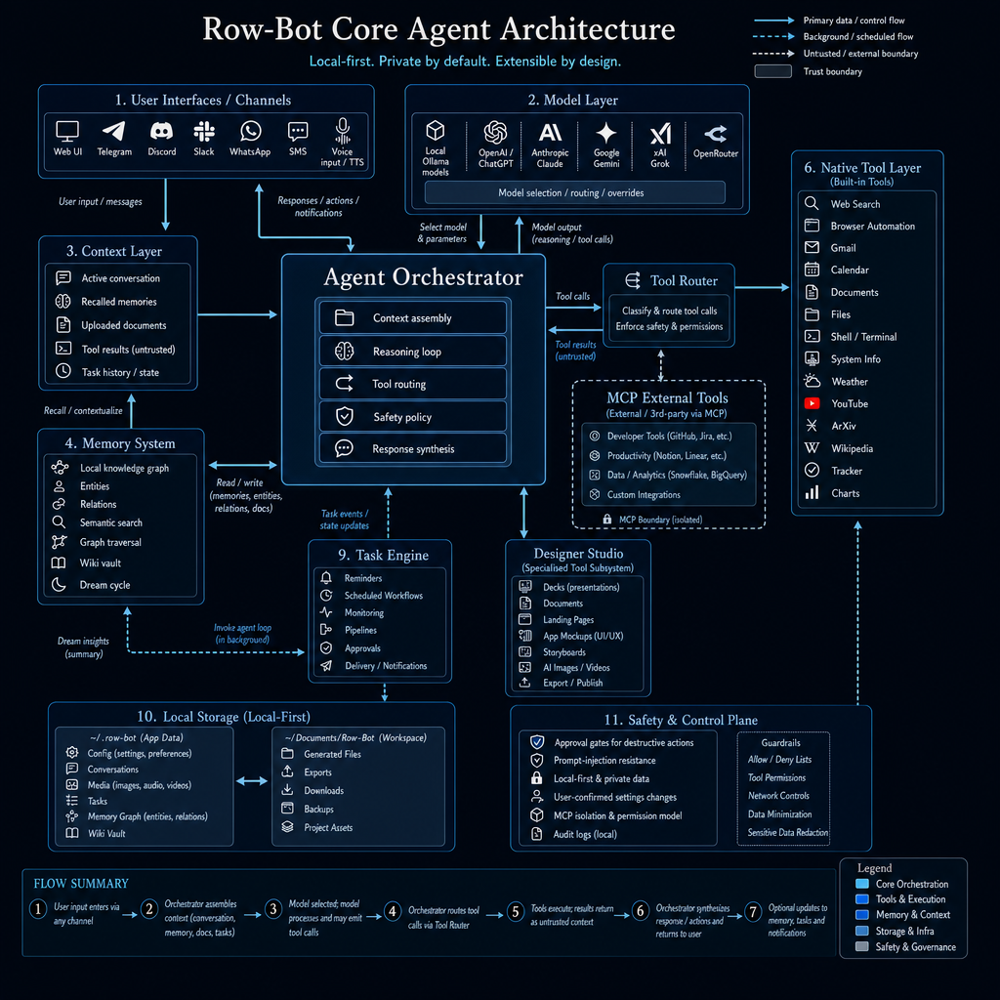</a><br><strong>Core Agent</strong></td>
      <td align="center"><a href="docs/Context_Arch.png">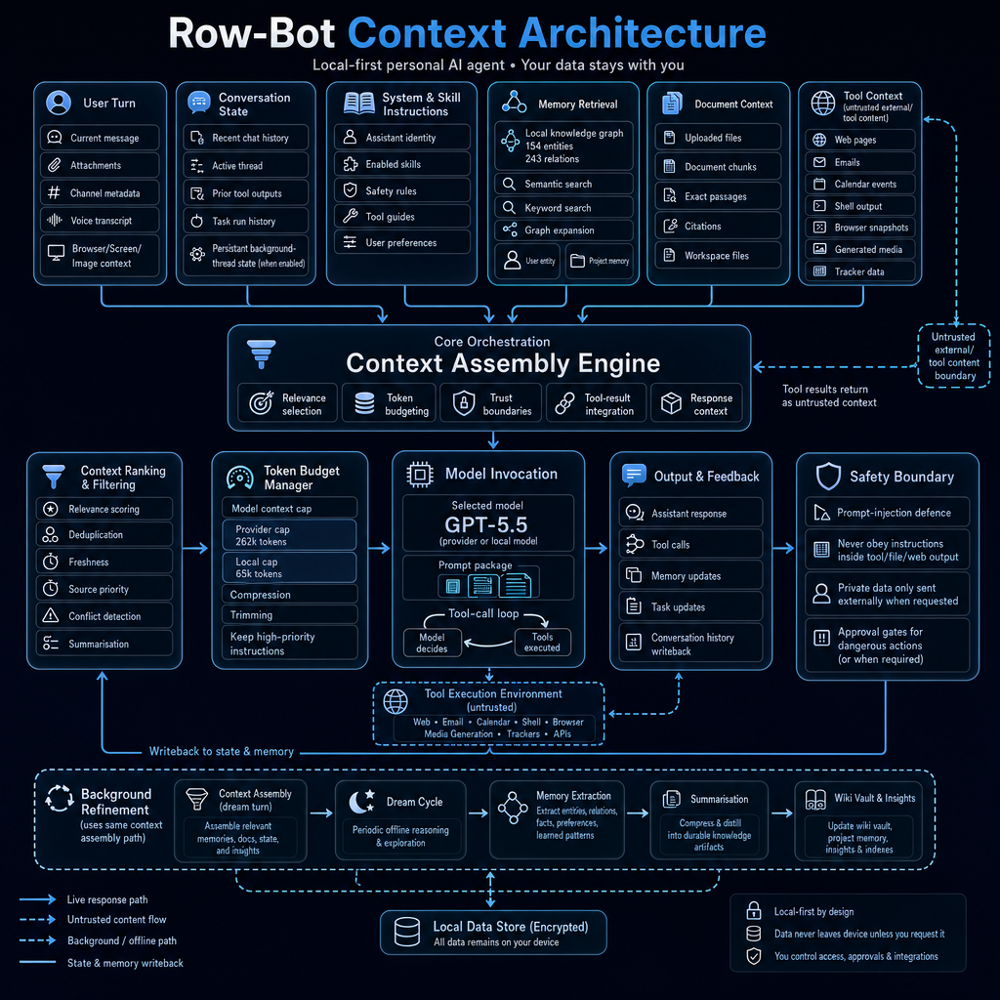</a><br><strong>Context Assembly</strong></td>
   </tr>
   <tr>
      <td align="center"><a href="docs/Knowledge_Graph_Arch.png">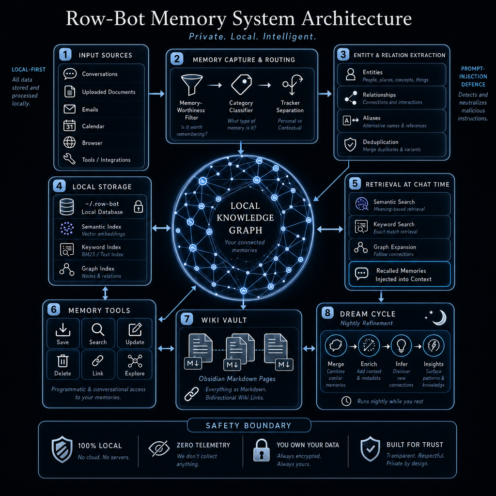</a><br><strong>Knowledge Graph</strong></td>
      <td align="center"><a href="docs/Workflows_Arch.png">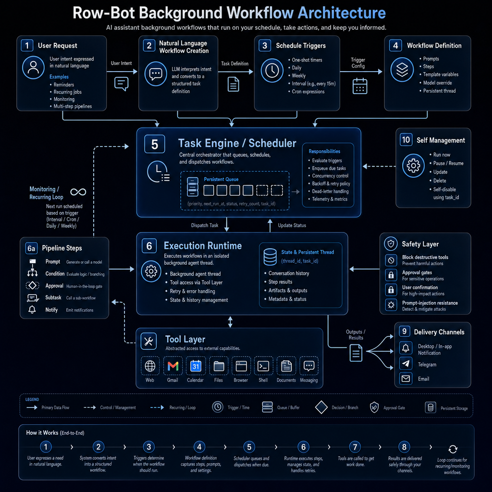</a><br><strong>Background Workflows</strong></td>
   </tr>
   <tr>
      <td align="center"><a href="docs/Multi_Channel_Arch.png">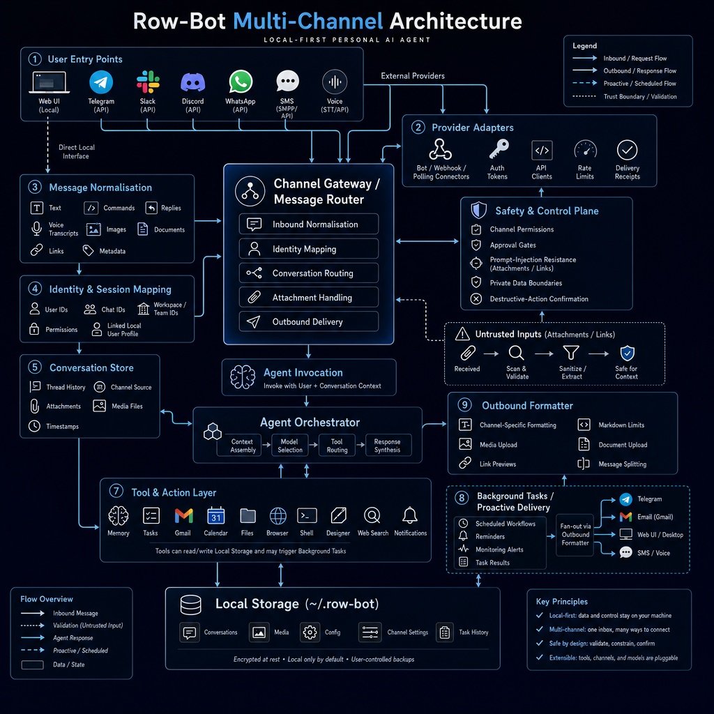</a><br><strong>Multi-Channel Runtime</strong></td>
      <td align="center"><a href="docs/Designer_Studio_Arch.png">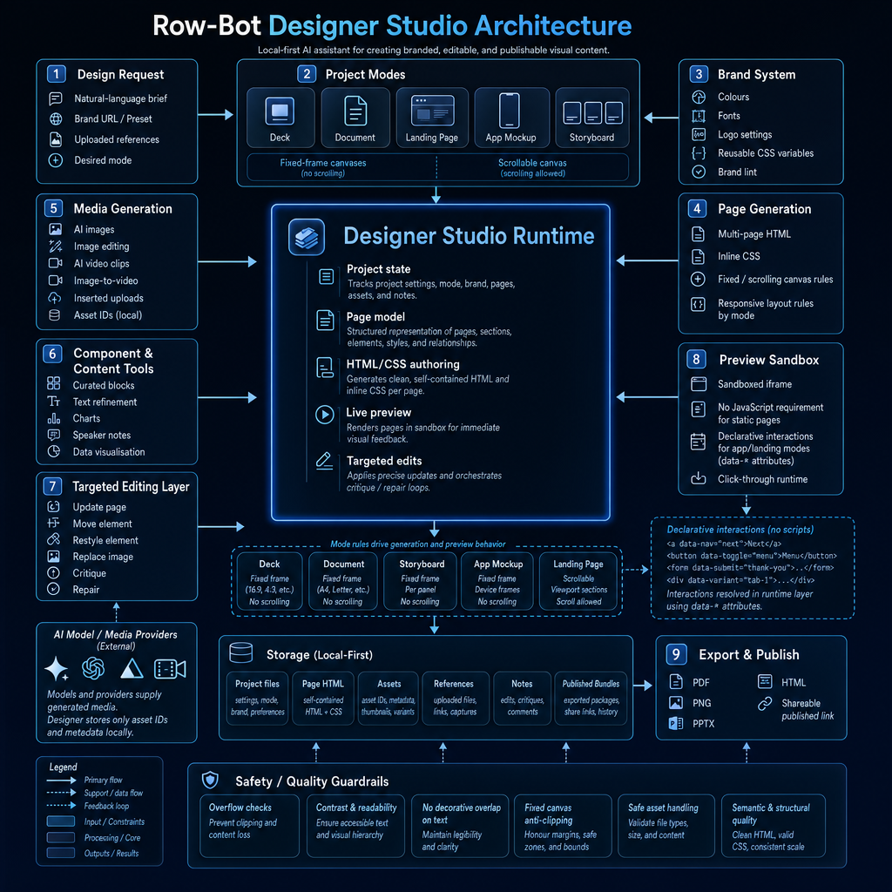</a><br><strong>Designer Studio</strong></td>
   </tr>
   <tr>
      <td align="center"><a href="docs/Developer_Studio_Arch.png">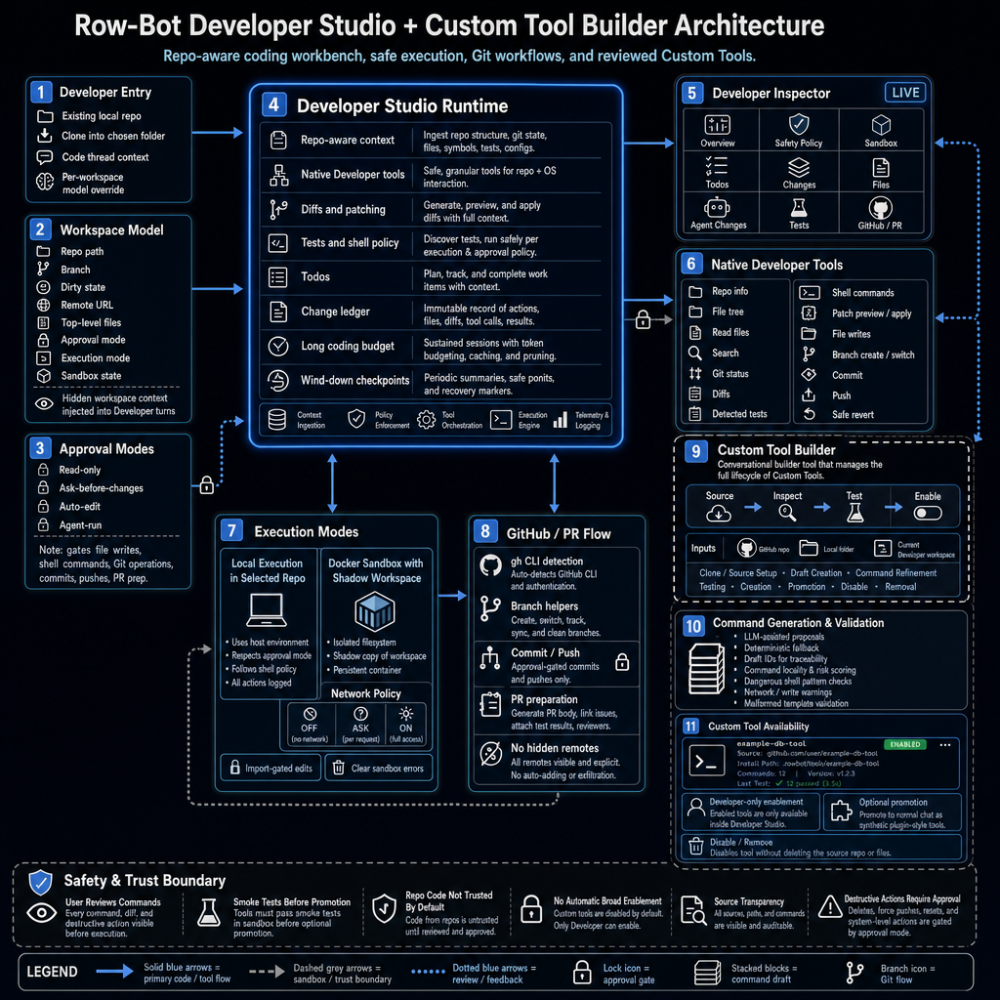</a><br><strong>Developer Studio</strong></td>
      <td align="center"><a href="docs/Skills_System_Arch.png">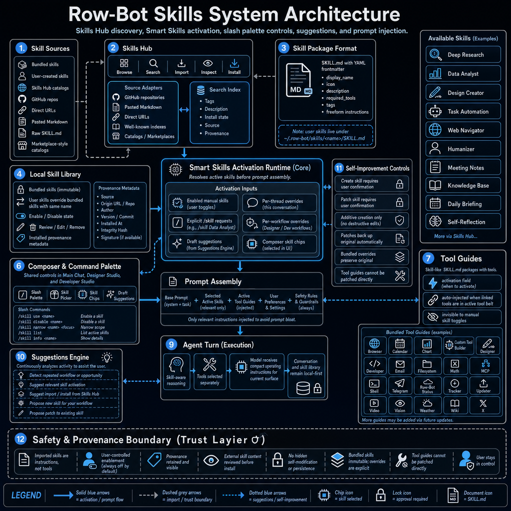</a><br><strong>Skills System</strong></td>
   </tr>
   <tr>
      <td align="center"><a href="docs/Safety_Privacy_Arch.png">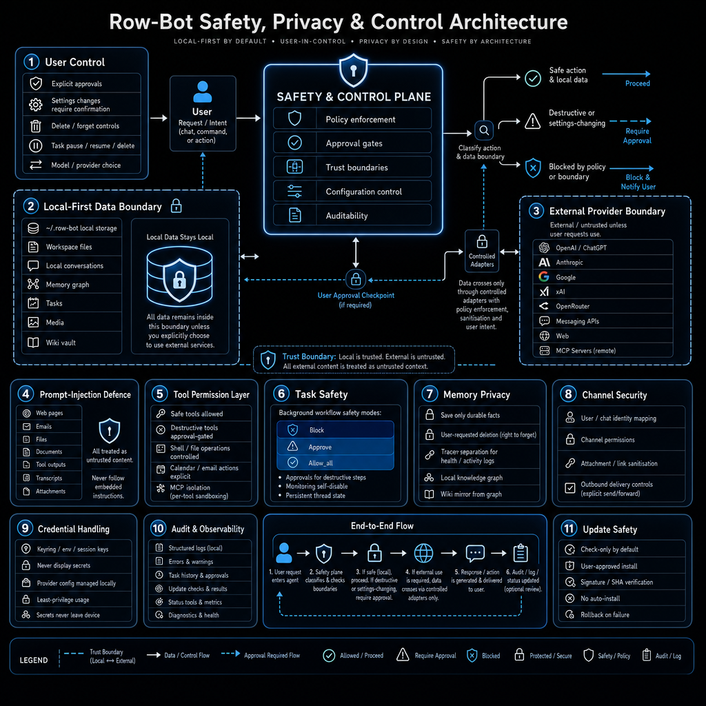</a><br><strong>Safety, Privacy &amp; Control</strong></td>
      <td align="center"><a href="docs/Self_Evolution_Arch.png">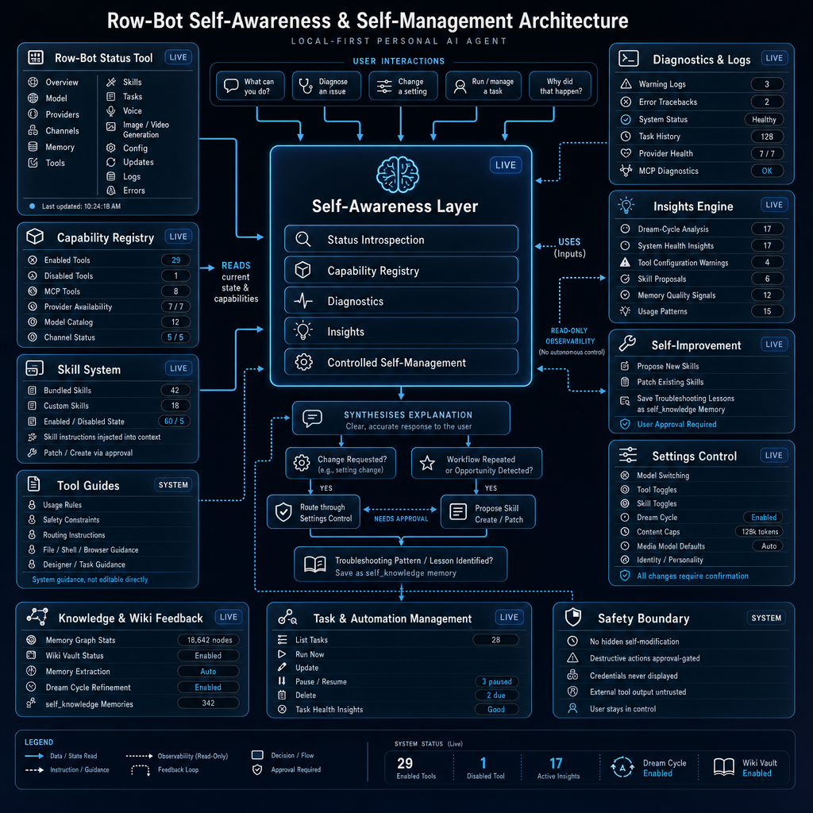</a><br><strong>Self-Evolution</strong></td>
   </tr>
</table>

## System Requirements

| Setup | Minimum | Recommended |
|-------|---------|-------------|
| Local model runtime | Windows 10/11 64-bit, macOS 12+, or glibc Linux x86_64; Python 3.12+ for source installs; 8 GB RAM for 8B models; about 5 GB disk for the app and one small model; internet for install and model download. | 16 to 32 GB RAM for 14B to 30B models; NVIDIA GPU with 8+ GB VRAM or Apple Silicon for much faster inference; 20+ GB disk for multiple or larger models. |
| Provider/custom models only | Windows 10/11 64-bit, macOS 12+, or glibc Linux x86_64; Python 3.12+ for source installs; 4 GB RAM; about 1 GB disk; internet for provider inference. | No GPU required. Use this path if you do not want local model downloads. |
| Computer Use beta | Windows 10/11 x86-64 or ARM64, or macOS 12+ on Intel/Apple Silicon; interactive local UI; internet for the explicit Cua Driver install or repair; Accessibility and Screen Recording permission on macOS. | Optional and off by default. Browser automation remains preferred for websites; Linux and unattended/background use are not supported. |
| Developer Sandbox | Docker Desktop or a compatible Docker/Podman runtime. | Optional. Developer Studio also works with local execution in the selected repo. |
| Public docs site | Node.js 20+ and npm. | Optional. Used only for local Docusaurus docs preview and generated-docs validation. |

Your default Brain model is set by the setup wizard. If you choose the local path, Row-Bot uses one of the models already exposed by your local runtime; 14B-class models are recommended for stronger agent/tool behavior, while smaller 8B-class models are better for 8 GB machines. Hosted and custom endpoint setups can skip local model downloads entirely.

## From Source

Install [Ollama](https://ollama.com/) first if you want Row-Bot's supported local model runtime. Provider-only and custom-endpoint setups can skip local model downloads.

```bash
git clone https://github.com/siddsachar/row-bot.git
cd row-bot
python -m venv .venv
```

Activate the environment:

```bash
# Windows
.venv\Scripts\activate

# macOS / Linux
source .venv/bin/activate
```

Install dependencies and launch with the locked dependency set:

```bash
python -m pip install "uv>=0.7,<1.0"
uv sync --locked --all-extras --group test
uv run python launcher.py
```

`requirements.txt` is kept only as a generated pip-compatible export for installers and repair helpers. If you cannot use uv, the fallback is:

```bash
python -m pip install -r requirements.txt
python launcher.py
```

On Windows and macOS, `launcher.py` starts the tray icon and opens the app on the first available local port, normally `http://localhost:8080`. On Linux it opens in the browser without a tray by default. If port 8080 is busy, Row-Bot picks the next free port.

Headless Linux/server mode:

```bash
python launcher.py --server --no-open --port 8080
```

Direct app launch:

```bash
python app.py
```

Direct launches default to `http://localhost:8080`. Set `ROW_BOT_PORT` to choose a different port.

Dependency edits go through `pyproject.toml`, not `requirements.txt`:

```bash
# edit pyproject.toml
uv lock
python scripts/export_locked_requirements.py
uv sync --locked --all-extras --group test
uv run python scripts/verify_runtime_dependencies.py all
```

Supported optional extras are `voice`, `designer`, `browser`, `channels`, `mcp`, `developer`, `local-embeddings`, and `media`. Development and packaged app builds use `all`; lightweight source installs can choose only the extras they need.

Recovery helpers:

```bash
python launcher.py --reset-tasks-db
python launcher.py --reset-db
python launcher.py --restore-data
```

These commands back up local SQLite files before recreating or restoring known task, memory, and thread databases.

Docs site preview:

```bash
cd docs-site
npm ci
npm run start
```

## Privacy

Local model runs stay on your machine. Documents, memories, conversations,
knowledge graph data, Agent Profiles, Goal Mode records, child-agent run
history, workflows, plugin state, logs, and user settings are stored locally
under `~/.row-bot` or the platform-specific Row-Bot app data paths used by the
installer. Current Row-Bot startup reads Row-Bot data only and no longer scans,
copies, repairs, or rewrites old `.thoth` data.

Mobile pairing records, hashed device credentials, revocation state, and
display-safe access events are stored locally in `mobile.db`. The mobile
companion has no Row-Bot cloud relay: your phone connects directly to the
running desktop host through the route you choose. A public tunnel exposes the
pairing gate to that URL, so keep tunnel links and pairing QR codes private and
revoke devices you no longer trust.

Computer Use is also opt-in. Row-Bot downloads the reviewed Cua Driver 0.7.1
asset only after a separate Install action, verifies its SHA-256, and keeps the
runtime private with upstream update checks disabled. Cua Driver has separately
disclosed third-party telemetry; Row-Bot requires acceptance before any Cua
process starts and does not send prompts, memories, secrets, screenshots, tool
arguments, typed content, or channel data to that telemetry. Target-window
screenshots are ephemeral, and typed values are excluded from durable history,
logs, checkpoints, approvals, memory, and media.

Provider and custom models are opt-in. When selected, the current conversation, model-visible tool context, and tool results are sent to that endpoint. Memories, documents, files, graph data, and other conversations stay local unless you explicitly include them in the current conversation or expose them through a tool result. Memory recall happens locally before any selected memory is inserted into the active turn.

Developer Studio only touches repos you link, clone, or explicitly allocate as
worktrees. Local execution runs in that repo or worktree. Docker Sandbox runs
in a shadow copy and requires explicit import before changing the real repo.
Skills Hub imports, plugins, Custom Tools, Agent Profiles, child-agent
promotion, and promoted Agent workflows are opt-in, testable or reviewable,
removable where applicable, and only affect normal chat or workflows after you
enable, select, or promote them.

Row-Bot does not require a Row-Bot account, and there is no Row-Bot-hosted middleman for provider calls.

## Project Docs

- [Complete public user guide](https://row-bot.ai/docs/)
- [Architecture](docs/ARCHITECTURE.md)
- [Visual architecture gallery](docs/architecture.html)
- [Public docs site source](docs-site/README.md)
- [Computer Use security decision](docs/COMPUTER_USE_SECURITY.md)
- [Plugin System v2](docs/PLUGIN_SYSTEM_V2.md)
- [Prompt context and cache contract](docs/PROMPT_CONTEXT_AND_CACHE.md)
- [Contributing guide](CONTRIBUTING.md)
- [Branching strategy](docs/BRANCHING.md)
- [Release process](docs/RELEASING.md)
- [Installer and CI verification plan](docs/INSTALLER_CI_VERIFICATION_PLAN.md)
- [Source layout and packaging](docs/SOURCE_LAYOUT.md)
- [Security policy](SECURITY.md)
- [Code of conduct](CODE_OF_CONDUCT.md)

All changes should go through a pull request. `main` is intended to stay releasable.

## License

Apache 2.0. See [LICENSE](LICENSE).

## Acknowledgements

Built with [NiceGUI](https://nicegui.io/), [LangGraph](https://langchain-ai.github.io/langgraph/), [LangChain](https://python.langchain.com/), [Ollama](https://ollama.com/), [FAISS](https://github.com/facebookresearch/faiss), [Cua Driver](https://github.com/trycua/cua), [Kokoro TTS](https://github.com/thewh1teagle/kokoro-onnx), [faster-whisper](https://github.com/SYSTRAN/faster-whisper), [HuggingFace](https://huggingface.co/), and [tiktoken](https://github.com/openai/tiktoken).
