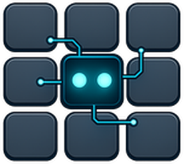
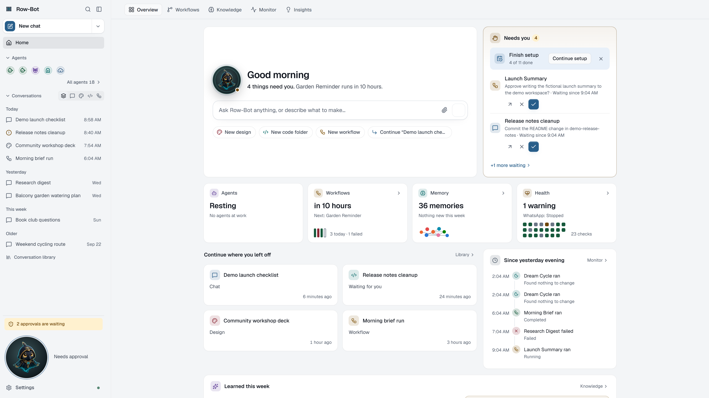

<p align="center">
  
</p>

<h1 align="center">Row-Bot</h1>

<p align="center"><sub>(formerly Thoth)</sub></p>

<p align="center">
   <a href="https://github.com/siddsachar/row-bot/releases"></a>
   <a href="https://github.com/siddsachar/row-bot/actions/workflows/ci.yml"></a>
   <a href="LICENSE"></a>
   
</p>

Row-Bot is a local-first desktop AI assistant for doing real work with models,
memory and tools. You talk to it in conversations; it remembers what matters in
a local knowledge graph, works in the files, code folders, designs, workflows
and channels you give it, delegates to focused agents, and asks before anything
risky. It runs local models through [Ollama](https://ollama.com/), provider API
keys, ChatGPT, Claude or Grok subscriptions, or any OpenAI-compatible endpoint,
and keeps your data on your machine. One React app serves the desktop window,
browsers, phones and server mode.

<p align="center">
  
</p>

## Features

- **Conversations that do the work** - ask for a deck, an app or a report and
  Row-Bot creates the design or code folder and keeps working in it; setup
  cards turn on a missing tool or connect an account in place.
- **Goals and agents** - goals that keep going until done and pause when they
  stop making progress; delegated agents with their own conversations, Stop
  and Message; reusable agent profiles.
- **Approvals wherever you are** - risky actions wait for Approve or Deny in
  the conversation, on Home, in the attention indicator, in Buddy or on a
  connected channel.
- **Memory and knowledge** - a personal knowledge graph with recall, review,
  Dream Cycle refinement, documents, and an Obsidian-compatible wiki vault.
- **Design and code panels** - decks, documents and mockups with Present,
  Review, export (PDF, HTML, PNG, PPTX) and publish; code folders with
  changes, files, Git, checks, an interactive terminal and an optional Docker
  sandbox.
- **Workflows** - scheduled, webhook and chained runs with approvals, delivery
  to channels and run history.
- **Tools and extensions** - web search, files, shell, managed browser,
  opt-in Computer Use on Windows and macOS, Gmail and Calendar, image and video
  generation, skills, plugins, MCP servers and custom tools.
- **Channels and voice** - Telegram, WhatsApp, Discord, Slack and SMS;
  dictation, Talk and read-aloud with local Whisper and Kokoro.
- **Monitor with fixes** - health checks that run by themselves, with one
  fix per problem, and Insights that suggest improvements.
- **Devices and remote access** - connect a phone or another computer with a
  QR code over Tailscale, your Wi-Fi or a public link; a Buddy desktop overlay
  on Windows and macOS; backup and restore of your profile.

## Platforms

| Platform | Package | Notes |
|----------|---------|-------|
| Windows 10/11, 64-bit | Installer | Native window, tray, Buddy overlay, Computer Use. |
| macOS 12+, Apple Silicon and Intel | DMG | Native window, tray, Buddy overlay, Computer Use. |
| Linux x86_64 (glibc) | Tarball and one-line installer | Opens in your browser; a native window and tray need GTK or Qt and AppIndicator. |
| Docker, amd64 and arm64 | `ghcr.io/siddsachar/row-bot` | Authenticated single-owner server. |

Ollama is optional, for local models only. System requirements are in the
[installation guide](https://row-bot.ai/docs/getting-started/installation).

## Install

Download the Windows installer or the macOS DMG from
[GitHub Releases](https://github.com/siddsachar/row-bot/releases/latest) and
run it. Upgrades and repairs keep your data.

On Linux:

```bash
curl -fsSL https://raw.githubusercontent.com/siddsachar/row-bot/main/installer/install-linux.sh | bash
# or a specific published release (replace X.Y.Z):
curl -fsSL https://raw.githubusercontent.com/siddsachar/row-bot/main/installer/install-linux.sh | bash -s -- X.Y.Z
```

The installer takes the latest release by default, verifies the tarball's
SHA-256, installs under `~/.local/share/row-bot` and creates
`~/.local/bin/row-bot`.

With Docker, from a checkout of this repository (pin `X.Y.Z` to a release
with a published container):

```bash
export ROW_BOT_IMAGE=ghcr.io/siddsachar/row-bot:X.Y.Z
docker compose -f deploy/docker/compose.yaml up --detach
docker compose -f deploy/docker/compose.yaml exec row-bot \
  row-bot access invite --layout desktop --origin http://127.0.0.1:8080
```

Read [Docker and VPS operations](https://row-bot.ai/docs/operations/docker)
before exposing it beyond loopback.

Upgrading from 4.x? Read the [v5.0.0 release notes](RELEASE_NOTES.md) first:
the old NiceGUI interface is gone and several places moved. Users still on
Thoth or an early Row-Bot build should first run a previous migration-capable
Row-Bot release.

### From source

You need Python 3.12 or 3.13, [uv](https://docs.astral.sh/uv/), Git, and
Node.js 24.15+ with npm 11 to build the client.

```bash
git clone https://github.com/siddsachar/row-bot.git
cd row-bot
python -m pip install "uv>=0.7,<1.0"
uv sync --locked --all-extras --group test
cd frontend && npm ci --ignore-scripts --no-audit --no-fund && npm run build && cd ..
uv run python launcher.py
```

`launcher.py` starts the tray and opens the app at
`http://localhost:8080/app-v2/` (the next free port if 8080 is busy); on Linux
it opens your browser. Starting it again while it runs shows the running app.
Other entry points:

```bash
uv run python launcher.py serve --port 8080   # authenticated headless server
uv run python app.py                          # server only, no tray or window
```

Dependency changes go through `pyproject.toml` and `uv.lock`; never edit
`requirements.txt` by hand (see [AGENTS.md](AGENTS.md#dependencies)).

## Quick start

1. On first launch Row-Bot asks **How should Row-Bot think?**: on this
   computer (Ollama), with your subscription (ChatGPT, Claude or Grok), with
   an API key, or with a custom endpoint. Your pick becomes the default model,
   a short test runs, and Home opens.
2. Start a conversation and ask for what you need, for example
   `Create a six-slide pitch deck for my startup`,
   `Review this repo and suggest the highest-risk issues`,
   `Remember that my mom's birthday is March 15` or
   `Remind me to call the dentist tomorrow at 9am`.
3. Press **Ctrl+K** (**⌘K** on macOS) to find conversations, commands and
   settings by plain words, such as "connect telegram" or "dark mode".
4. **Setup Center** (Continue setup on Overview, or search for it with
   Ctrl+K) walks through the rest: knowledge, workflows, channels, accounts,
   tools and voice.

The [first launch guide](https://row-bot.ai/docs/getting-started/first-launch)
covers each path.

## Configuration and data

- **Data folder:** `~/.row-bot` (`%USERPROFILE%\.row-bot` on Windows), or the
  folder in `ROW_BOT_DATA_DIR`. It holds conversations, memory, workflows,
  settings and logs (`row_bot_app.log` and `logs/row_bot.log`).
- **Workspace folder:** `~/Documents/Row-Bot` by default, where file tools,
  exports and backups go; change it in Settings › System.
- **Secrets:** provider keys and sign-ins are stored in Windows Credential
  Manager, the macOS Keychain or Linux Secret Service/KWallet; Docker uses
  encrypted records with a separate key volume. JSON settings hold metadata
  only.
- **Backups:** Settings › Data › Back up now makes a zip without secrets.
- **Reference:** [models and providers](https://row-bot.ai/docs/configuration/models-and-providers),
  [environment and configuration](https://row-bot.ai/docs/reference/generated/environment-and-config),
  [data storage](https://row-bot.ai/docs/reference/generated/data-storage) and
  [command-line options](https://row-bot.ai/docs/reference/generated/cli).

## Remote access and server mode

Row-Bot is a **single-owner, multi-device** application: one owner can use the
same instance from several trusted browsers, but it is not multi-user hosting.
A device joins with a one-time invitation (a QR code or link that expires after
10 minutes) and then holds a revocable session. Connect devices from Settings ›
Devices & remote access, or from a trusted terminal:

| Path | Use it when | Boundary |
|------|-------------|----------|
| Tailscale Serve | Private access across your devices (recommended). | Row-Bot never installs Tailscale, signs in, enables Funnel or overwrites another app's route. |
| Direct LAN | A trusted network. | Plain HTTP is unencrypted; prefer Tailscale or HTTPS outside a trusted LAN. |
| SSH tunnel | A remote host with no published port. | Keep Row-Bot on loopback and forward a port. |
| Docker | A headless, isolated instance. | Compose publishes to host loopback by default. |
| HTTPS reverse proxy or VPS | You manage DNS, TLS and the proxy. | Set `ROW_BOT_PUBLIC_URL`, `ROW_BOT_ALLOWED_HOSTS` and `ROW_BOT_TRUSTED_PROXY_CIDRS` exactly; never buffer `/api/v1/events`. |

```bash
row-bot serve --host 127.0.0.1 --port 8080
row-bot access invite --layout desktop --origin http://127.0.0.1:8080
row-bot access list
row-bot access doctor
```

If the owner loses every browser session, create a new invitation from a
trusted local terminal, SSH session or `docker compose exec`.
Back up the complete active `ROW_BOT_DATA_DIR` while Row-Bot is stopped (with
Docker, the data and encryption-key volumes together). Details:
[Remote access and server mode](https://row-bot.ai/docs/operations/remote-access)
and [Docker and VPS operations](https://row-bot.ai/docs/operations/docker).

## Development

- `src/row_bot/` holds the application (FastAPI server, agents, tools,
  providers, memory, workflows, channels); `frontend/` is the React client,
  served at `/app-v2/`. See [docs/SOURCE_LAYOUT.md](docs/SOURCE_LAYOUT.md) and
  [docs/ARCHITECTURE.md](docs/ARCHITECTURE.md).
- [AGENTS.md](AGENTS.md) is the canonical guide for contributors and coding
  agents: ground rules, where tests go and the test lanes.
- `scripts/run_test_matrix.py` is the test source of truth; CI runs its tiers:

```bash
uv run python scripts/run_test_matrix.py fast       # static checks and contracts
uv run python scripts/run_test_matrix.py changed --base origin/main
uv run python scripts/run_test_matrix.py pr         # what the Linux PR lane runs
uv run python scripts/run_test_matrix.py platform   # OS-sensitive tests
uv run python scripts/run_test_matrix.py browser-smoke
npm --prefix frontend run check                     # client lint, types, tests, build
```

## Documentation

- [User guide](https://row-bot.ai/docs/) - the complete public documentation
  ([source](docs-site/README.md))
- [Release notes](RELEASE_NOTES.md)
- [Privacy and safety](https://row-bot.ai/docs/privacy-safety),
  [Computer Use](https://row-bot.ai/docs/computer-use) and its
  [security decision](docs/COMPUTER_USE_SECURITY.md)
- [Architecture](docs/ARCHITECTURE.md), [client platform](docs/CLIENT_PLATFORM.md),
  [plugin system](docs/PLUGIN_SYSTEM_V2.md) and
  [prompt context and cache](docs/PROMPT_CONTEXT_AND_CACHE.md)
- [Release process](docs/RELEASING.md) and [branching](docs/BRANCHING.md)
- [Troubleshooting](https://row-bot.ai/docs/troubleshooting)
- [row-bot.ai](https://row-bot.ai/) - product tour and demos

## Privacy

Row-Bot has no account system, no hosted inference and no first-party
telemetry; conversations, memory and settings stay on your machine, and
provider calls go only to the provider or endpoint you choose. The opt-in Computer Use beta relies on Cua
Driver, whose upstream telemetry is disclosed and must be accepted first; see
[privacy and safety](https://row-bot.ai/docs/privacy-safety).

## Contributing and security

Pull requests are welcome; read [CONTRIBUTING.md](CONTRIBUTING.md) and the
[code of conduct](CODE_OF_CONDUCT.md). Please report vulnerabilities privately
as described in [SECURITY.md](SECURITY.md).

## License

Apache 2.0. See [LICENSE](LICENSE) and [NOTICE](NOTICE). Built with React,
FastAPI, LangGraph, LangChain, Ollama, FAISS, Cua Driver, Kokoro TTS,
faster-whisper and FunASR/SenseVoice.
