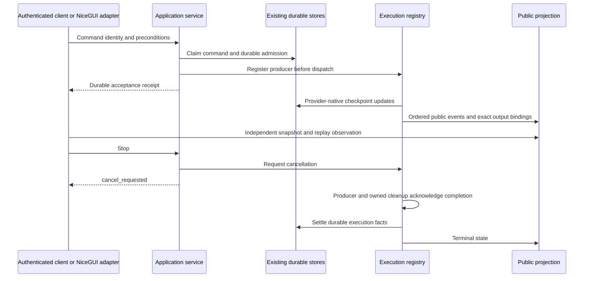

# Client platform service boundary

The launcher opens the React application at `/app-v2/` by default. The retained
NiceGUI compatibility application stays mounted at `/` and is available through
the explicit `--legacy-ui` launch choice. Both clients and the authenticated
`/api/v1` transport use the same application services, execution registry,
checkpoint store and resource bindings. This boundary does not start a separate
daemon or copy transcripts into a new database.
See [frontend development](../frontend/README.md),
[dual hosting](CLIENT_PLATFORM_HOSTING.md), and
[the shared product system](CLIENT_PLATFORM_PRODUCT_SYSTEM.md).

## Ownership

| Concern | Implementation owner |
| --- | --- |
| Conversation commands and queries | `application.client_platform.ClientPlatformService` |
| Admission, receipts, passes and segments | `runtime.admissions`, using the existing tasks database |
| Cancellation and producer completion | `runtime.executions.GenerationRuntimeRegistry` |
| Durable conversation content | Existing thread metadata and LangGraph checkpoints in `threads` |
| Public snapshots and bounded event replay | `projection.conversation.ConversationProjection` |
| Workspace and artifact relationships | `conversation_resources`, using additive thread metadata |
| Authentication and request admission | Existing `access` middleware and session authority |
| Protocol sessions, subscriptions and wire validation | `api.v1` |
| Attachment bytes and references | `application.attachments`, using existing thread media storage |
| Attachment interpretation | `file_context`; legacy helper imports delegate here |
| Execution attachment caches | `application.attachment_context`; scoped around admitted producer work |
| Generated media publication | `application.generated_media`; exact tool-call results and existing media storage |
| Existing message-shape conversion | `message_projection`; pure shared converter with legacy helper exports |
| Page elements and renderer recovery | `ui.legacy_adapter` and existing NiceGUI rendering |
| Inspector snapshot collection | `developer.inspector_snapshot`, using asyncio without NiceGUI scheduling |

Module paths are relative to `row_bot`. Workflow approvals, Goal transitions
and child-agent records remain with their existing domain owners. The execution
registry coordinates active producers without replacing those state machines.



## Hosting and recovery

`install_client_platform(app, service, instance_id=...)` mounts routes on an
existing host without taking over its global exception handlers or lifespan.
NiceGUI startup composes `ApplicationLifecycle` explicitly.
`create_client_platform_app(service, ...)` creates a standalone FastAPI host
with the same access middleware and an explicit application lifespan.

Startup reconciles durable admission facts without repeating external work.
Shutdown closes admission, requests cancellation and reports unacknowledged
producers as stopping. A Stop response or timeout is not proof of quiescence.
Closing a page does not release resources owned by an active producer.
Retained child and workflow runners supply a domain cleanup callback for
cancellation or resource rejection before their target starts. The registry
keeps ownership through that cleanup; failures after target entry remain the
target's responsibility. A child whose resource inheritance fails before its
run is created is rolled back through the existing conversation cleanup owner.
Shared workspace bindings do not authorize allocation removal. Conversation
cleanup captures its own durable child-run identity before purging that row;
Developer cleanup accepts only the matching thread or agent allocation owner.
Ephemeral large live text uses bounded spools under the existing media owner;
shutdown closes them only after producers are quiescent. Completed text remains
in its native checkpoint. Public paging reads the existing SQLite checkpoint
blob without constructing persisted Python objects or loading unrelated content.

Checkpoint association uses native message identity and exact output comparison.
New media sidecars retain native message IDs. Older sidecars and resource
metadata retain explicit compatibility readers. These supported data readers
are separate from the temporary NiceGUI adapter lifecycle.

Each page owns its renderer, selection epoch and subscription. Reconnect
invalidates assumptions about delivered patches, reconstructs the transcript
and preserves the unsent composer value. It does not replay a send.
Secondary NiceGUI viewers recover final checkpoint state. Their retained renderer
does not continuously mirror another page's live DOM; protocol subscribers have
independent live replay. This is a temporary presentation limitation.

Attachment preparation runs after admission and uses the configured Vision
service and existing file materializer. Chart and image/video tool caches are
execution-local for headless runs, including runs with no attachments. Their
legacy cache fallback remains for existing NiceGUI callers. Bound workspace
relationships determine attachment placement when present.
Parallel tool calls have private pending media slots and exclusively created
output filenames. Captured references travel with the exact native tool result;
an unavailable or oversized media reference does not discard a successful tool
result or delete the generated original.

## Wire contracts and validation

Canonical DTOs are in `api.v1.schemas`. Generated JSON Schema, OpenAPI and
TypeScript contracts are in `contracts/client-platform/v1`. Mutations carry an
owner-scoped idempotency key, explicit command/client session IDs and expected
aggregate revisions. Revisions are decimal strings. Opaque resource and media
references are not filesystem paths or authorization credentials. Errors contain
public codes rather than raw exceptions or tool arguments.

```console
python scripts/generate_client_platform_contracts.py
python scripts/generate_client_platform_contracts.py --check
uv run python scripts/run_test_matrix.py fast
uv run python scripts/run_test_matrix.py changed --base origin/main
uv run python scripts/run_test_matrix.py pr
```

Do not hand-edit generated contracts. Recordings distinguish exercised service
behavior from contracts reserved for later storage/delivery work. TypeScript
runtime validators reject unknown discriminators and unexpected fields; native
Node tests their behavior. The import/public-annotation ratchet checks the new
Python boundaries. Neither check is described as a full semantic type checker.

Contract and subsystem tests use isolated real stores with scripted providers
and transports. `tests/browser/client_platform` runs the real NiceGUI host with
disposable data and fake dependencies. The PR lane performs `uv sync`; use a
separate validation environment when an application may use the development
environment. Browser evidence does not certify live accounts, installed-machine
behavior, signing or notarization.
